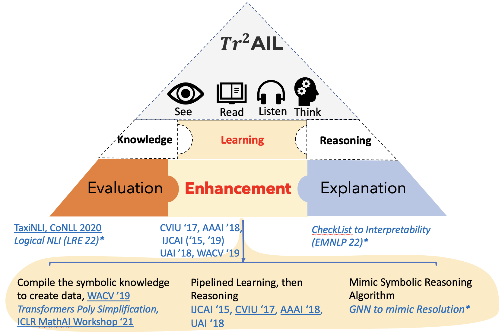
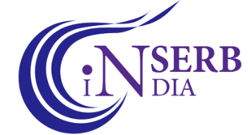

<!-- +++
# An example of using the custom widget to create your own homepage section.
# To create more sections, duplicate this file and edit the values below as desired.

date = "2016-04-20T00:00:00"
draft = false

title = "Teaching and Mentoring"
subtitle = ""
widget = "custom"

# Order that this section will appear in.
weight = 100

+++ -->

<h2> <em>Tr</em>$^2$AIL: Trust and Transparency in AI through Logic </h2>

The <em>Tr</em>$^2$AIL research group is led by Prof. Somak Aditya. The long-term goal of the lab is to achieve transparent Human-aware AI systems through Logic and Reasoning. We want the AI systems to be able to <em>reason-in-the-wild</em> and do so transparently for the end-users with whom it is expected to interact. Technically, we will work on the fundamental challenges faced by current neural and probabilistic logical systems in achieving such properties. I am fortunate to be working with a group of passionate <u><a href="/people">student reserachers</a></u> and my wonderful <u><a href="/external">collaborators</a></u>. Our group acknowledges the kind and generous support by <a href="https://www.microsoft.com/">Microsoft</a>, <a href="https://corp.rakuten.co.in/">Rakuten</a> (through sponsored internship), <a href="https://toloka.ai/grants/">Toloka AI</a>, SERB DST and IIT Kharagpur (see <a href="#grants">Grants</a> for details).

   

<a href="/people">Group Members</a></u>

<a href="/external">External Collaborators</a></u>

<a href="/publication">Publications</a></u>

<a href="#grants">Grants</a></u>

<a href="#faqs">FAQs</a></u>

 

<!-- <h3> <u> Group Members</u> </h3> -->

<!-- <h4> FACULTY </h4>
<ul class="fa-ul">
<li> <i class="fa-li fas fa-star fa-xs" style="color:black;"></i> PI: Prof. Somak Aditya </li>
</ul>

<h4> PhD/MTech Students </h4>
<ul class="fa-ul">
<li><i class="fa-li fas fa-star fa-xs" style="color:black;"></i> Sachin Vashishth, PhD CSE (<em>Ongoing</em>) </li>
<li><i class="fa-li fas fa-star fa-xs" style="color:black;"></i> Vivek Karde, MTech CSE (<em>Ongoing</em>) </li>
</ul>

</ul>  -->

<!-- <h4> Undergraduate Students (BTech Degree) </h4>
<ul class="fa-ul">
<li><i class="fa-li fas fa-star fa-xs" style="color:black;"></i> Atharva Naik, BTech CSE </li>
<li><i class="fa-li fas fa-star fa-xs" style="color:black;"></i> Druhin Abrol, BTech, Mechanical Engineering </li>
</ul>

<h4> External Students </h4>
<ul>
<li> PhD Student: Deepanway Ghosal, CSE, SUTD </li>
<li> Dual Degree Student: Abhinav Menon, CSE, IIIT Hyderabad (Intern) </li>
</ul> -->

I am looking for motivated Ph.D students who are interested in pursuing <b><u>their thesis</u></b> in the exciting juncture of classical and statistical AI (often dubbed as neuro-symbolic methods). For prospective students, please see answers to FAQs below (to be updated). 

<!-- 

Prof. Animesh Mukherjee and I are actively looking for a full-time joint PhD student to work on multi-lingual multi-modal representation and reasoning. Please apply though <a href="http://www.iitkgp.ac.in/phd-admission">here</a>, and send me an email.

 -->

<section id="grants">
<h3> Grant Support </h3>
We are grateful to be supported by the following generous organizations:
<!-- <ul>
<li> SERB DST Startup Research Grant (2021-23) ~ INR 26 Lacs </li>
<li> IIT Kharagpur Faculty Startup Research Grant (2022-24) ~ INR 25 Lacs</lt>
<li> <a href="https://toloka.ai/grants/">Toloka AI</a> Annotation Grant (2022) ~ USD 300 </li>
<li> <a href="https://corp.rakuten.co.in/">Rakuten</a> Sponsored Joint Internship for Debrup Das (2023 Summer) </li>
<li> <a href="https://www.microsoft.com/">Microsoft</a>: "Accelerate Foundation Models Academic Research" jointly with Prof. Animesh Mukherjee (2023) ~ USD 3000 </li>
</ul> 
#fc374e,36aeb3, 162d59, #FFD580, rgba(252,55,78,0.7), rgba(252,55,78,0.7)
-->
<ol class="olcards">
		<li style="--cardColor:#FFD580">
			

				<!-- 
😀
 -->
        <!-- 

 -->
				
SERB DST SRG (2021-23)

				
SERB DST Startup Research Grant (2021-23) ~ INR 26 Lacs
        | Topic: "Learning from Rules and Data for Image Analytics"
        

			

		</li>
		<li style="--cardColor:rgba(22,45,89,0.2)">
			

				<!-- 
😁
 -->
				
IIT Kharagpur FSRG (2022-24)

				

        IIT Kharagpur Faculty Startup Research Grant (2022-24) ~ INR 25 Lacs
          Topic: The Role of Feedback in Vision-Language enabled Embodied Agents towards Applications in Desire Management
          Joint PI: Prof. Pawan Goyal
        

			

		</li>
    <li style="--cardColor:#FFD580">
			

				<!-- 
😜
 -->
				
Microsoft Accelerate Foundation Models Grant (May 2023 - Mar 2024)

				
Microsoft: "Accelerate Foundation Models Academic Research" (2023) ~ USD 30000 | Topic: "Perils and Prevention of Prompt Injection Attacks for Large Language Models"
          Joint PI: Prof. Animesh Mukherjee

			

		</li>
		<li style="--cardColor:rgba(22,45,89,0.2)">
			

				<!-- 
😉
 -->
				
Toloka AI Grant (2022)

				
<a href="https://toloka.ai/grants/">Toloka AI</a> Annotation Grant (2022) ~ USD 300
        | Topic: "Infusing Language Model with Affordances"
        

			

		</li>
	</ol>

<svg style="visibility: hidden; position: absolute;" width="0" height="0" xmlns="http://www.w3.org/2000/svg" version="1.1">
  <defs>
        <filter id="round">
            <feGaussianBlur in="SourceGraphic" stdDeviation="5" result="blur" />    
            <feColorMatrix in="blur" mode="matrix" values="1 0 0 0 0  0 1 0 0 0  0 0 1 0 0  0 0 0 19 -9" result="goo" />
            <feComposite in="SourceGraphic" in2="goo" operator="atop"/>
        </filter>
    </defs>
</svg>
</section>

<!-- 

<s><b> NEW!!! (Oct 2022): </b> I am looking for a motivated BTech student (IIT KGP CS preferably), very proficient in coding to work with us in a multi-university collaboration on "Spatio-Temporal Reasoning in Vision and Language" with U.Utah, IIIT-H, and industrial partners.</s>

 -->

<!--     -->

<!-- 

  Please note, I am not entertaining any request for short-term projects or internships. My expectation is that interested students are associated with a project for 6 months to an year (and also motivated enough to be associated till we reach a satisfactory milestone). <u>Also</u>, I am looking for students who are deeply interested in (and has some background in) the theoretical aspects of AI techniques (machine learning, probability, and logic).

 -->

<section id="faqs">
<h3> FAQs for Propsective Students </h3>
<!-- Some answers are tailored towards Ph.D students; but should be applicable to MTech and BTech thesis students as well. 
  -->

<ol type="i">
<li> 
 What are the projects that you will be working on?  
Here are some broad questions that we are interested in:
<ul class="fa-ul">
<li><i class="fa-li fas fa-star fa-xs" style="color:black;"></i> How do we reason transparently? What does it mean to reason transparently? </li>
<li><i class="fa-li fas fa-star fa-xs" style="color:black;"></i> How do we reason with noisy and incomplete knowledge sources? Can we utilize semi-structured (or more natural) forms of knowledge representation?  </li>
<li><i class="fa-li fas fa-star fa-xs" style="color:black;"></i> How do we elicit missing knowledge? </li>
<li><i class="fa-li fas fa-star fa-xs" style="color:black;"></i> How can human-in-the-loop help? </li>
</ul>

See the <a href="/project">project page</a> and <a href="/publication">publication</a> to see how solving such technical challenges may affect a range of applications -- from NLP, Vision, to automated mathematical reasoning.
</li>

<!-- <li> 
 How often do you want to meet with your students? Will there be lab meetings etc.?  
Depends on the project and student. Meetings will be more frequent near deadlines and short-term projects. 
Things will slowly evolve as we become bigger. So, if you join now, you can play a significant part in defining how the lab will take shape.
</li> -->

<!-- <li> 
 How do I know that my mindset rightly aligns with you?  
I would love to welcome everyone whoever shows interest. However, your individual passion, self-motivation, punctuality and sense of responsibility are incredibly improtant to thrive in a competitive and collaborative research environment. So, I would expect that from all members.

Furthermore, through our work, we will attempt to make theoretically sound yet practically relevant contributions (which is easier said than done). So, if you have an appreciation for the theoretical roots of CS, and a desire to make impactful and quantifiable progress in practical applications; that makes you a perfect fit.

Last, but not the least, having fun and enjoying your tenure here is non-negotiable! :)
</li> -->

<!-- your success in the lab will depend on a few factors. There is a saying that I love -- "wherever you go, there you are". Your individual self-motivation, resilience, and passion about research is irreplacable and would be the central factors controlling the outcome of your research. Apart from passion, CS research is often highly collborative. So, punctuality, and a sense of responsibility are also essential to thrive in such an enviornment. -->
<!-- <li> 
 In general, how much freedom will I get to explore?  
For starting PhDs, I will set you onto a path with some rough plan towards a long-term goal. As we explore and after your first few publications, you are expected be able to independently sketch your own path. This is important for Ph.D students, as Ph.D is all about the training to become an independent researcher. 

The same goes for MTech and BTech students, in a somewhat fast-tracked way. Initially, students often require certain period of training, which can be best achieved by participating in ongoing projects in the lab. Then, I will expect you to slowly pitch in your ideas and solidify the specific problem that you wish to work on. For a sponsored project however, you might be expected to work towards a high-level goal set by the sponsor and myself. But, we will always be open to exploring new ideas.
</li> -->

<li> 
 Is my expertise right for your lab?  
I am happy to welcome students with diverse expertise, ideas and background. But, based on my experience, following expertise seem absolutely essential. First, coding expertise (python mostly) and scripting knowledge (shell script, R is a plus). Being able to figure out your way through installation issues, knowledge about Git, shell scripting, and basic idea about GPUs are important. If you are an IIT-KGP student, make sure you have <em>obtained A or above in PDS theory and Lab</em>. Share a link to your Git repositories. Participation in popular open-source projects is a plus.
 
Secondly, even if you are not familiar with ML, in-depth understanding of Algorithms, Probability and statistics is important. Knowledge of Logic, ML, DL, traditional NLP (parsing, POS tagging, chunking etc.), linguistics, or traditional image processing is a huge plus. 
</li>

<li>
 How do I contact you?  
If you are an IIT KGP student, please send an inquiry to <a href="mailto:saditya@cse.iitkgp.ac.in">my email</a>. Kindly mention which program you are enrolled in. If you are not a KGP student, kindly visit the IIT Kharagpur website to see how to enroll in the Ph.D or Masters program. 

I plan to take 1 or 2 external students who shows proven depth in at least one of the axes (linguistics/ML/DL/CV) through Publications/Courses/olympiads as interns (for one or two semesters). Feel free to email me if that interests you, and you fit the profile.

<!--  
Ph.D. Positions:   For details about PhD application procedure, please visit <a href="http://www.iitkgp.ac.in/phd">HERE</a>.  
M.S. (by Research) Positions:   For M.S., please apply through the list of advertised institute projects <a href="http://www.iitkgp.ac.in/temporary-jobs">HERE</a>. Once you are already a project staff, you can apply for MS.  -->

</li>
</ol>
</section>

